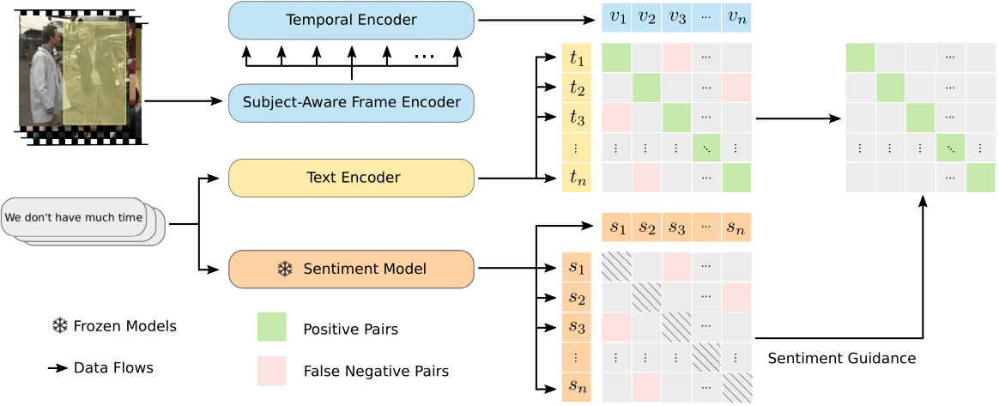

# Learning Emotion Representations from Verbal and Nonverbal Communication

This is a Pytorch implementation of the [EmotionCLIP paper](https://openaccess.thecvf.com/content/CVPR2023/papers/Zhang_Learning_Emotion_Representations_From_Verbal_and_Nonverbal_Communication_CVPR_2023_paper.pdf):
```
@inproceedings{zhang2023learning,
  title={Learning Emotion Representations from Verbal and Nonverbal Communication},
  author={Zhang, Sitao and Pan, Yimu and Wang, James Z},
  booktitle={Proceedings of the IEEE/CVF Conference on Computer Vision and Pattern Recognition},
  pages={18993--19004},
  year={2023}
}
```

## Overview




## Requirement
The code is built with following libraries:
- pytorch
- scikit-learn
- einops
- ftfy
- regex
- pandas
- orjson
- h5py
- wandb
- tqdm
- rich
- termcolor

Extra setup is required for data preprocessing. Please refer to [preprocessing](preprocessing/).

## Usage
### Testing

The pre-trained EmotionCLIP model can be downloaded [here](https://drive.google.com/file/d/1iWA7KfiR1JjRi-hD6R4LK5cug1FMcblD/view?usp=drive_link). 
We follow the linear-probe evaluation protocol employed in CLIP.
To test the pre-trained model on a specific dataset, run
```
python linear_eval.py \
  --dataset <dataset_name> \
  --ckpt-path <path_to_the_pretrained_model>
```

### Training
We use the weight provided by OpenCLIP as the starting point for our training. Please download the weight [here](https://github.com/mlfoundations/open_clip/releases/download/v0.2-weights/vit_b_32-laion2b_e16-af8dbd0c.pth) and put it under `src/pretrained`.
To do training on the YouTube video dataset with default settings, run
```
python main.py \
  --video-path <path_to_the_video_frames_folder> \
  --caption-path <path_to_the_video_caption_folder> \
  --sentiment-path <path_to_the_sentiment_logits_file> \
  --index-path <path_to_the_index_file>
```

# Acknowledgments
Our code is based on [CLIP](https://github.com/openai/CLIP) and [OpenCLIP](https://github.com/mlfoundations/open_clip).